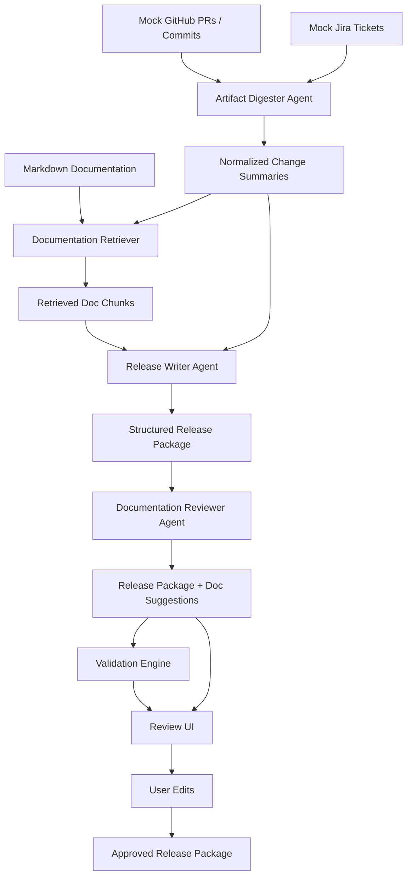

# Design Document

## 1. Architecture Decisions

This project implements a small end-to-end MVP for an automated release documentation agent.

The goal is to demonstrate a controlled LLM workflow that can turn engineering artifacts into a reviewable release package. The MVP focuses on the core product loop rather than production integrations.

```text
Ingest → Digest → Retrieve → Generate → Validate → Review / Approve
```

### Architecture Diagram



### Key Decisions

- **Mock connectors first**  
  The MVP uses mock GitHub, Jira, and Markdown documentation sources. This keeps the project focused on the release-documentation workflow rather than API authentication and integration setup.

- **Agents as controlled LLM workflow steps**  
  An agent is treated as a bounded LLM task worker: fixed prompt, limited input, and structured output. This avoids a hard-to-debug autonomous agent swarm.

- **Structured outputs**  
  LLM output is returned as structured JSON so it can be parsed, validated, displayed, edited, and approved.

- **Retrieval before generation**  
  Existing documentation is retrieved before generation so documentation suggestions are grounded in actual docs.

- **Validation before approval**  
  The system runs deterministic checks before the user approves the release package.

## 2. AI Workflow

The MVP uses a controlled agent workflow.

Each agent follows the same pattern:

```text
bounded input
→ standard prompt
→ structured JSON output
→ parsing / validation
```

### Artifact Digester Agent

**Purpose:** Convert raw GitHub and Jira artifacts into normalized change summaries.

**Input:** pull requests, commits, Jira tickets

**Output:** change summaries with source IDs, affected systems, customer-facing flag, and risk level.

### Release Writer Agent

**Purpose:** Generate the main release package.

**Input:** normalized change summaries, retrieved documentation chunks, source evidence IDs

**Output:**

```json
{
  "changelog": [],
  "internalReleaseNotes": "",
  "customerReleaseNotes": "",
  "documentationUpdates": [],
  "evidence": []
}
```

The prompt instructs the model to:

- use only provided sources
- separate internal and customer-facing language
- avoid unsupported claims
- attach evidence IDs
- return JSON only

### Documentation Reviewer Agent

**Purpose:** Suggest documentation updates based on the generated release package and retrieved docs.

**Output:** impacted docs, suggested sections, reason, and evidence IDs.

## 3. Reliability Strategy

The main risk is that the LLM may generate unsupported, incomplete, or overly broad release documentation.

The MVP addresses this with:

- bounded context
- fixed prompt contracts
- structured JSON output
- evidence references
- deterministic validation
- human review and approval

### Validation Checks

The validation engine checks:

- output schema validity
- Jira ticket coverage
- valid evidence references
- documentation suggestions reference retrieved docs
- customer-facing notes avoid obvious internal implementation details
- generated items without evidence are flagged

These checks are not a full hallucination benchmark, but they provide practical guardrails for a release-documentation workflow.

## 4. UI Scope

The UI is intentionally lightweight.

It only needs to support the core review loop:

```text
Generate → Review results → Edit → Approve
```

The UI shows:

- generated changelog
- internal release notes
- customer-facing release notes
- documentation update suggestions
- source evidence
- validation / review results
- edit and approve controls

The UI does not need authentication, persistence, multi-user workflows, or production styling.

## 5. Tradeoffs Made

### Mock integrations vs real APIs

Real GitHub and Jira integrations would be more realistic, but mock data is enough to demonstrate the core workflow and keeps the project easy to run.

### Controlled agents vs autonomous agents

A fully autonomous agent system may look more powerful, but it is harder to test and trust. This MVP uses controlled LLM agents with narrow responsibilities.

### Simple retrieval vs full vector RAG

The MVP can start with simple Markdown retrieval. The retriever interface can later be upgraded to embeddings and vector search.

### Human approval vs full automation

Release notes may be customer-facing, so the MVP requires human approval before finalization.

## 6. Future Improvements

- Real GitHub and Jira connectors
- Confluence, Google Docs, Slack, Zendesk, and Linear integrations
- Embedding-based retrieval and vector database support
- Stronger hallucination and regression evaluation
- Persistent release history
- Async generation jobs
- Multi-user review and approval workflow
- Customer-specific release note templates
- Feedback loop from user edits
- Deployment integration to trigger generation after merge/deploy events

## 7. Success Criteria

The MVP is successful if it demonstrates:

- ingestion of GitHub/Jira/docs artifacts
- controlled LLM agents with narrow prompt contracts
- structured release package generation
- documentation retrieval
- source evidence grounding
- validation checks
- review/edit/approve workflow
- clear path to production integrations

Core principle:

```text
Use LLM agents for bounded drafting and reasoning tasks, but use evidence, validation, and human review to make the workflow reliable.
```
